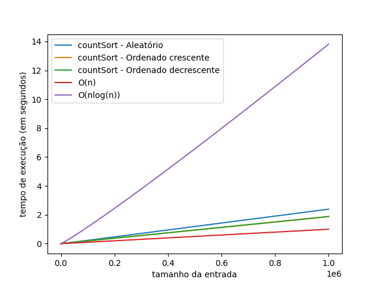

# Metodologia-Artigo

## 1 - Pacotes necessários:
  * Python >= 3.8.5
  
#### 1.1 - Bibliotecas do Python necessárias:
  * numpy
  * memory_profiler
  * sys
  * datetime
  * matplotlib
  * math
  
#### 1.2 - Instalação:
  1. Clone o repositório usando: <code>git clone https://github.com/ArthurGM18/Metodologia-Artigo</code>.
  2. Utilize <code>cd Metodologia-Artigo/codigo/</code> para entrar na pasta com os arquivos.
 
## 2 - Sobre o Sistema

#### 2.1 - Funcionamento geral

  O sistema gera arquivos aleatórios que servem de entrada para testes do algoritmo de ordenação Counting Sort. O primeiro código que deve ser executado é o referente a gerar os arquivos que servem como entrada para os testes. Os arquivos serão armazenados no diretório dados/.
  
#### 2.2 - Gerador de arquivos de entrada
  
  Esse deve ser o primeiro passo durante a execução deste sistema, já que os arquivos de testes devem ser gerados pelo próprio usuário. Os arquivos serão armazenados no diretório dados/. Para executar o código de gerador é necessário estar dentro do diretório codigo/ e rodar o comando:
  
  <code> python3 gerador.py </code>
  
  O processo de execução é um pouco demorado pelo fato do sistema estar criando arquivos com diferentes tamanhos. Ao final do processo será alocado 708.3 MB no total para armazenar os dados de todos os arquivos.
  
#### 2.3 - Executar os testes no algoritmo

 Para executar os testes no algoritmo Counting Sort é necessário ter gerado os arquivos de entrada pela seção 2.2. Estando dentro do diretório codigo/ rode o comando:
 
 <code> python3 main.py [argumento] </code>
 
 O [argumento] pode ser:
     * aleatorio: Executa o algoritmo sequências aleatórias dos arquivos gerados;
     * ordenado: Executa o algoritmo sobre sequências ordenadas de forma crescente dos arquivos gerados;
     * inverso: Executa o algoritmo sobre sequências ordenadas de forma decrescente dos arquivos gerados;
     
 Exemplo de execução: <code> python3 main.py aleatorio </code>
 
 Isso irá executar tanto o teste de tempo de execução, quanto o teste de memória utilizada pelo sistema (usando o memory_profiler). Ao final do processo será salvo um arquivo de resultado no diretório resultados/ relacionado ao resultado desejado.
 
#### 2.4 - Plotagem dos gráficos

 Para plotar os gráfico é necessário estar dentro do diretório codigo/ e rodar o comando:
 
 <code> python3 show_data.py </code>
 
 Será pego os dados referentes ao diretório resultado/ e plotado um gráfico usando eles.

## 3 - Resultados obtidos

 Teste para tempo de execução do algoritmo Counting Sort.

